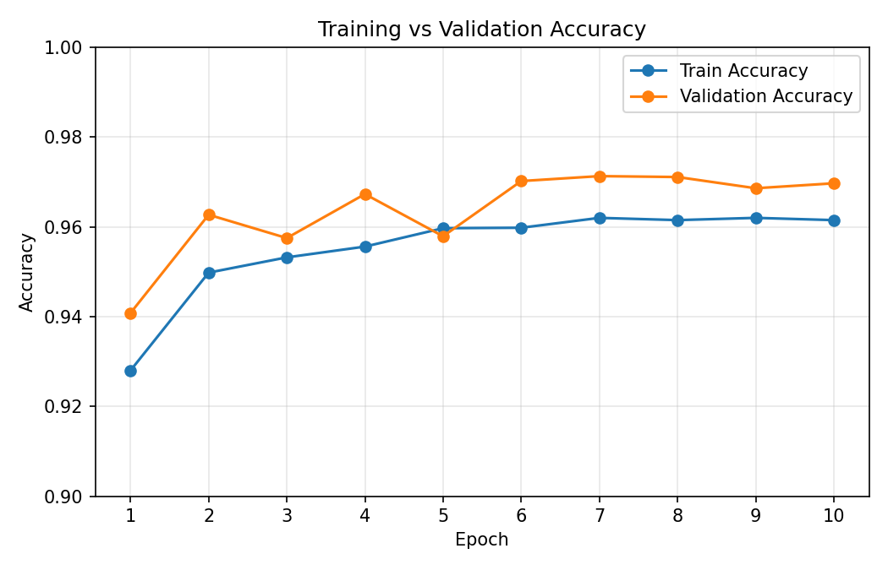
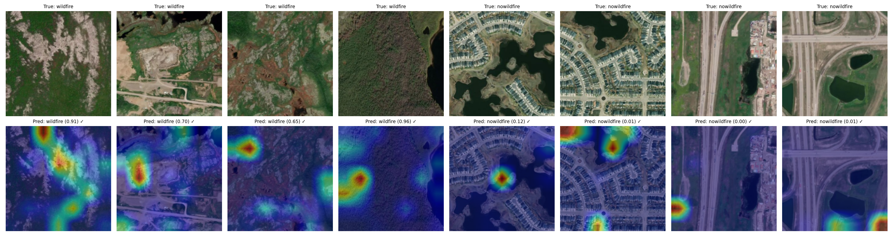
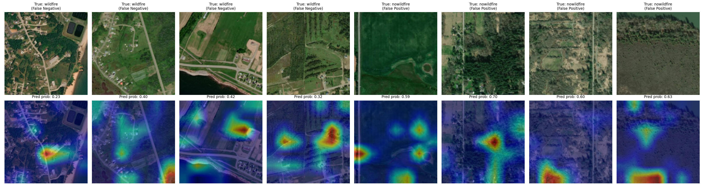

# Wildfire Detection from Satellite Imagery

An end-to-end PyTorch pipeline that classifies satellite image tiles as wildfire-affected/prone terrain or not, using transfer learning on a frozen ResNet50 backbone, with Grad-CAM explainability to inspect *why* the model makes each decision.

Built as a personal deep learning project — dataset, model, training, evaluation, and explainability are each isolated into their own module rather than one notebook script.

## Problem & Dataset

Binary classification on the [Kaggle Wildfire Prediction Dataset](https://www.kaggle.com/datasets/abdelghaniaaba/wildfire-prediction-dataset): ~42,850 satellite image tiles (224×224, Quebec, Canada, via Google Earth Engine) labeled `wildfire` / `nowildfire`. Important nuance discovered during analysis (see [Findings](#findings--limitations) below): this dataset labels terrain that has experienced or is prone to wildfire, **not** necessarily images showing active flames or smoke.

## Architecture

- **Backbone:** ResNet50 pre-trained on ImageNet, all convolutional layers frozen.
- **Head:** `Linear(2048 → 1)` + `Sigmoid`, trained from scratch — this is the only part of the network with trainable weights.
- **Loss / Optimizer:** Binary Cross-Entropy (`nn.BCELoss`), Adam (`lr=1e-3`) over the head only.
- **Data:** Resize to 224×224, ImageNet normalization; random horizontal flip + rotation on the training split only.
- **Explainability:** Grad-CAM hooked into `layer4[-1]`, the final convolutional block.

## Project Structure

```
wildfire-detection/
├── dataset/              # Kaggle dataset (train/valid/test) — not committed
├── src/
│   ├── dataset.py        # DataLoaders, transforms, corrupted-file scanning
│   ├── model.py           # ResNet50 + custom head
│   ├── train.py            # Training/validation loop
│   ├── evaluate.py         # Accuracy/Precision/Recall/F1/Confusion Matrix
│   └── explain.py          # Grad-CAM: single image, class comparison grid, failure-case mining
├── main.py                # CLI: train / evaluate / explain / grid / failures / all
├── assets/                 # Result images used in this README
└── requirements.txt
```

## Results

Trained for 10 epochs (CPU). Best checkpoint selected by validation accuracy.



**Test set (6,300 images):**

| Metric | Value |
|---|---|
| Accuracy | 97.73% |
| Precision | 98.77% |
| Recall | 97.10% |
| F1-Score | 97.93% |

**Confusion Matrix**

| | Pred: No-Fire | Pred: Fire |
|---|---|---|
| **Actual: No-Fire** | 2,778 | 42 |
| **Actual: Fire** | 101 | 3,379 |

Precision is higher than recall — the model is slightly more prone to missing a real wildfire (101 false negatives) than to raising a false alarm (42 false positives). For a safety-oriented system, that's the wrong direction to be conservative in, and it's the main thing I'd tune further (e.g. lowering the decision threshold below 0.5) if extending this project.

## Grad-CAM: Is the model looking at the right thing?

**Class comparison** — 4 wildfire + 4 no-wildfire test images, original above, Grad-CAM overlay below:



The wildfire examples' attention consistently lands on visible burn-scar-like patchy/discolored terrain rather than on undisturbed green vegetation — a good sign the model learned real, task-relevant texture rather than an arbitrary shortcut.

**Real failure cases** — mining the test set for actual false negatives and false positives (not synthetic examples) and running Grad-CAM on each:



## Findings & Limitations

A few things worth calling out explicitly, found while probing this model rather than assumed going in:

- **The label isn't "active fire," it's "fire-affected/prone terrain."** Some wildfire-labeled test images show no visible burn scarring at all, which explains why several false negatives sit close to the decision boundary (0.23–0.42) rather than being confidently wrong — there was little visual signal for the model (or a human) to key on in those specific tiles.
- **The most consistent failure mode is a texture confusion, not an urban/rural bias.** The false positives share a visually "patchy" or segmented field texture with correctly-classified wildfire images — the model appears to partly conflate normal agricultural/land-use patchiness with burn-scar texture.
- **All 8 mined failure cases were borderline (probabilities between 0.23–0.70), not confidently wrong.** This is a healthier failure mode than confident misclassification — the model is uncertain on genuinely ambiguous tiles rather than certain and incorrect.
- **Grad-CAM's color scale is normalized per-image**, not an absolute confidence measure — a region can appear "hot" simply as the strongest signal *relative to the rest of that image*, even when the model's overall prediction is confidently the opposite class. Verified directly: a farmland test image showed a visible hotspot on field-boundary texture while the model correctly predicted `no-wildfire` at p=0.033. Grad-CAM outputs should always be read alongside the predicted probability, not in isolation.

## Setup

```bash
pip install -r requirements.txt
```
Download the Kaggle dataset above and extract into `dataset/` with `train/`, `valid/`, `test/` subfolders (each containing `wildfire/` and `nowildfire/`).

## Usage

```bash
python main.py --mode train    --data_dir dataset --epochs 10
python main.py --mode evaluate --data_dir dataset
python main.py --mode explain  --data_dir dataset --image_path path/to/image.jpg
python main.py --mode grid     --data_dir dataset --n_per_class 4
python main.py --mode failures --data_dir dataset --n_per_type 4
python main.py --mode all      --data_dir dataset --epochs 10
```

Dataset integrity check (recommended after downloading, since large Kaggle zips sometimes contain a few truncated files):
```bash
python -m src.dataset --data_dir dataset          # report only
python -m src.dataset --data_dir dataset --remove  # report and delete corrupted files
```

## Version Control

The dataset and trained checkpoints (`.pth`) are intentionally excluded via `.gitignore` — only source code is tracked. See the file for the exact exclusions.
